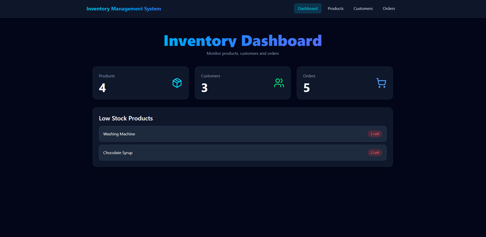
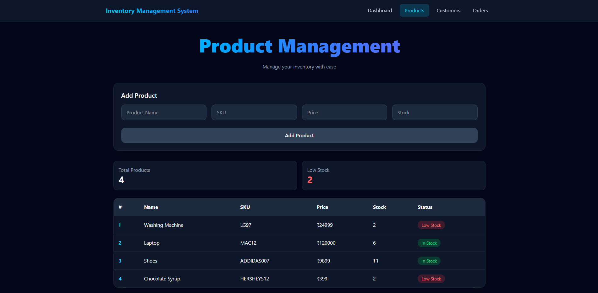
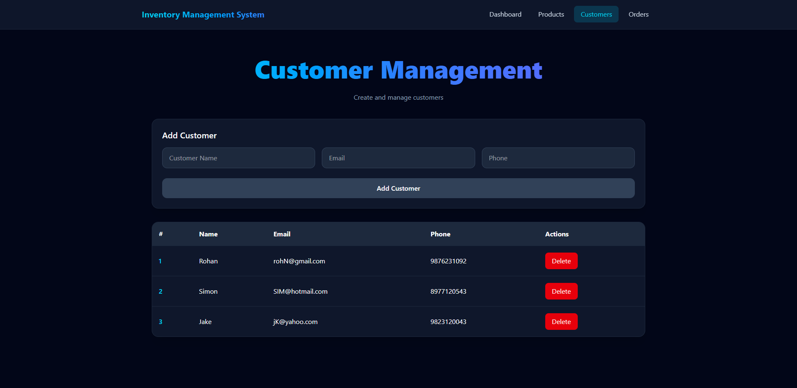
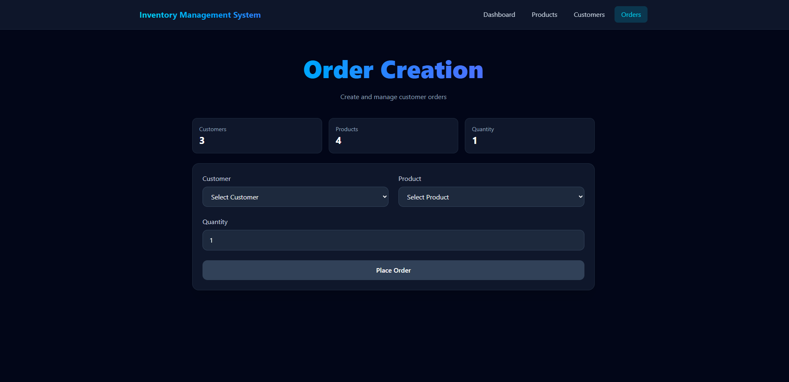

# Inventory Management System
## Overview

A full-stack Inventory Management System built using React, FastAPI, PostgreSQL, and Docker.

The system allows users to manage products, customers, and orders while automatically tracking inventory levels and enforcing business rules.

## Features

### Product Management
- Create products
- View products
- Unique SKU validation

### Customer Management
- Create customers
- View customers
- Unique email validation

### Order Management
- Create orders
- Inventory validation
- Automatic stock reduction
- Prevent ordering when stock is insufficient

### Dashboard
- Product count
- Customer count
- Order count
- Low stock alerts

## Tech Stack

### Frontend
- React
- Tailwind CSS
- Axios

### Backend
- FastAPI
- SQLAlchemy

### Database
- PostgreSQL

### DevOps
- Docker
- Docker Compose

## Project Structure

inventory-management-system/

├── backend/

├── frontend/

├── docker-compose.yml

└── README.md

## Run Locally

### Clone Repository

git clone <repository-url>

cd inventory-management-system

## Run Using Docker

docker compose up --build

Frontend:
http://localhost:5173

Backend:
http://localhost:8000

Swagger Docs:
http://localhost:8000/docs

## Environment Variables

Backend

DATABASE_URL=postgresql://postgres:postgres@db:5432/inventory_db

Frontend

VITE_API_URL=http://localhost:8000

## Screenshots

### Dashboard

### Products

### Customers

### Orders

## API Endpoints

Products

GET /products

POST /products

DELETE /products/{id}

Customers

GET /customers

POST /customers

DELETE /customers/{id}

Orders

GET /orders

POST /orders